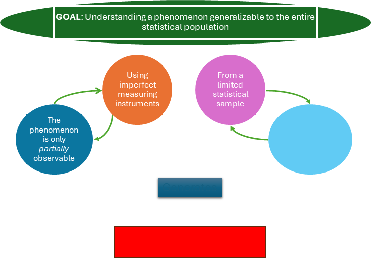
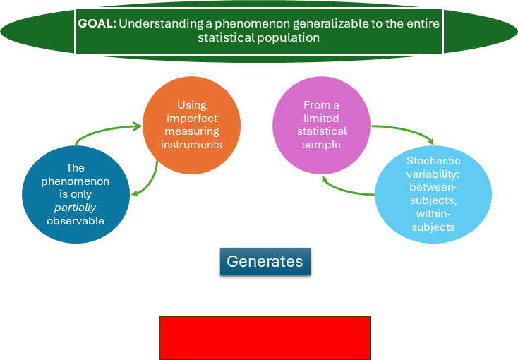

```{r setup, include=FALSE}
# Presentazione preparata da Michele Scandola per Workshop ITRN @ Rome June 19, 2024
# 
# Licenza cc by-nc 4.0

library(fontawesome)
library(DiagrammeR)
library(knitr)
library(afex)
library(reshape2)
library(ggplot2)
library(gridExtra)
knitr::opts_chunk$set(echo = FALSE)

GimmeStar <- function(p, not_trend = FALSE){
  if (is.na(p)) {warning("presence of NAs");return("")}
  if (p>0.10) return("")
  if (p>0.05 & !not_trend) return("+")
  if (p>0.01) return("*")
  if (p>0.001) return("**")
  else return("***")
}
```

## A question

::: center
* If I am _objective_,
* If I am employing state-of-the-art methods,
* If I am rigorously collecting data,
* If I am applying a correct statistical approach,
* Then, <span style="color:red;">why should I care about Open Science?</span>
:::

## 

### Table of topics

::: center
> 1. **If I am _objective_,**
> 2. If I am employing state-of-the-art methods,
> 3. If I am rigorously collecting data,
> 4. If I am applying a correct statistical approach,
> 5. Then, <span style="color:red;">why should I care about Open Science?</span>
:::


## "If I am _objective_"

::: center

:::

## "If I am _objective_"

> Somebody has to formulate the hypothesis, and conduct and
> interpret the experiment. <br>
> All of this is done by observers.<br>
> Most science is based on the assumption that you can remove the observer
> to get objective statements. <br>
> Without observers, there would be no science.

-- Stuart Umpleby

## "If I am _objective_"

{width="700"}<br>[@simonsohn2020specification]

## "If I am _objective_"

::: center

:::

## "If I am _objective_"

::: center

:::

## "If I am _objective_"

::: center

:::

## "If I am _objective_"

::: center

:::

## "If I am _objective_"

::: center

:::

## "If I am _objective_"

::: center

:::

## "If I am _objective_"

::: center

:::

<br><br><br><br><br><br><br><br><br><br><br><br><br><br><br><br><br><br><br><br>
* Uncertainty $\neq$ Objectivity


## 

### Table of topics

::: center
> 1. ~~If I am _objective_,~~
> 2. **If I am employing state-of-the-art methods**,
> 3. If I am rigorously collecting data,
> 4. If I am applying a correct statistical approach,
> 5. Then, <span style="color:red;">why should I care about Open Science?</span>
:::

## "If I am employing state-of-the-art methods"

We want to determine whether, in post-stroke patients with neglect,
high levels of anxiety are associated with more debilitating neglect.

```{r, echo=FALSE}
shinyApp(
  ui = fluidPage(
    fluidRow(
      column(width = 3, "How many groups?"),
      column(width = 3,
             textAreaInput("n_groups_1", "", "1", width = "50px")
      ),
      column(width = 3,
             textAreaInput("n_groups_2", "", "1", width = "50px")
      ),
      column(width = 3,
             textAreaInput("n_groups_3", "", "1", width = "50px")
      )
    ),
    fluidRow(
      column(width = 3, "Which test are we going to use to evaluate anxiety?"),
      column(width = 3,
             textAreaInput("anx_1", "", "STAI-Y", width = "200px")
      ),
      column(width = 3,
             textAreaInput("anx_2", "", "STAI-Y", width = "200px")
      ),
      column(width = 3,
             textAreaInput("anx_3", "", "STAI-Y", width = "200px")
      )
    ),
    fluidRow(
      column(width = 3, "How do we assess neglect?"),
      column(width = 3,
             textAreaInput("neg_1", "", "Bisection test", width = "500px")
      ),
      column(width = 3,
             textAreaInput("neg_2", "", "Bisection test", width = "500px")
      ),
      column(width = 3,
             textAreaInput("neg_3", "", "Bisection test", width = "500px")
      )
    ),
    actionButton("compute_button",
                 label = "How many different studies?",
                 class = "btn-success"),
    dataTableOutput("results")
  ),

  server = function(input, output) {
    
    observeEvent(input$compute_button, {
      dat <- expand.grid(
        c(input$n_groups_1, input$n_groups_2, input$n_groups_3),
        c(input$anx_1, input$anx_2, input$anx_3),
        c(input$neg_1, input$neg_2, input$neg_3)
      )
      
      colnames(dat) <- c("Groups", "Anxiety", "Neglect")
      
      dat_txt <- matrix(nrow = 10, ncol = 5)
      ic <- ir <- 1
      for(rr in 1:nrow(dat)){
        dat_txt[ir, ic] <-
          paste(dat$Groups[rr], dat$Anxiety[rr], dat$Neglect[rr], sep = "\n")
        if(ic < 5){
          ic <- ic + 1
        } else {
          ic <- 1
          ir <- ir + 1
        }
      }
      
      dat_txt <- data.frame(dat_txt)
      
      output$results <- renderDataTable({
        dat_txt
      })
    })
  },

  options = list(height = 700)
)
```

## 

### Table of topics

::: center
> 1. ~~If I am _objective_,~~
> 2. ~~If I am employing state-of-the-art methods~~,
> 3. **If I am rigorously collecting data**,
> 4. If I am applying a correct statistical approach,
> 5. Then, <span style="color:red;">why should I care about Open Science?</span>
:::

## "If I am rigorously collecting data"

### Dance of p-values [@cumming2014new]

Simulation of 50 obervations with effect size Cohen's d = 0.5

```{r}
set.seed(1)

inputPanel(
  ## the data was actually generated before-hand
  actionButton("generate_button_2",
               label = "Generate the data.",
               class = "btn-success")
)

renderPlot({
  if( (input$generate_button_2) != 0 ){

    out <- list()
    
    for(i in 1:25){
      y <- rnorm(n = 50, mean = 0.5)
      
      p <- t.test(y)$p.value
      m <- mean(y)
      ci <- quantile(y, probs = c(0.025,0.975))
      
      out[[i]] <- data.frame(
        p       = p,
        mean    = m,
        ci_low  = ci[1],
        ci_high = ci[2],
        i = i
      )
    }
    
    out <- do.call("rbind", out)
    
    ggplot(out, aes(y = m, ymin = ci_low, ymax = ci_high, x = i, colour = p < 0.05))+
      geom_pointrange()+
      geom_text(y = max(out$ci_high)+0.1, aes(x = i, label = round(p, 3)))+
      theme_bw()+
      coord_flip()+
      xlab("")+ylab("")+
      scale_color_brewer(palette = "Set1")
    }
  }
)

```


## 

### Table of topics

::: center
> 1. ~~If I am _objective_,~~
> 2. ~~If I am employing state-of-the-art methods~~,
> 3. ~~If I am rigorously collecting data~~,
> 4. **If I am applying a correct statistical approach**,
> 5. Then, <span style="color:red;">why should I care about Open Science?</span>
:::


## If I am applying a correct statistical approach

In analysing our data, we can follow one of four main approaches [@gelman2013garden]:

1.  `r fa("hourglass", fill = "grey")` Applying a unique statistical test on data.
2.  `r fa("medal", fill = "green")` Applying a pre-registered statistical test on data, pre-specifying all choices.
3.  `r fa("triangle-exclamation", fill = "orange")` Applying a statistical test on data, that would be different given a different data set (**Researcher's dof**)
4.  `r fa("skull-crossbones", fill = "red")` Applying all possible choices in data handling and statistical tests (the so-called **fishing**) 

## If I am applying a correct statistical approach

-   Data are not passively collected and analysed.
-   Removing outliers, transforming variables, choosing independent variables and<br>confounders are routine decisions for researchers.
-   From a single data set, we can have multiple processed data sets.
-   Researchers select a single (or a few) data processing choices and then present this as the only analysis that ever would have been done.
-   The inevitable arbitrariness in the data and the sensitivity of the result is hidden to the reader.

[@steegen2016increasing]

## If I am applying a correct statistical approach

Let's imagine that we want to understand if we are able to connect laterality cues to motor answers faster with the upper or the lower limbs.

Therefore, we prepared an experiment, where participants had to listen or read the words "Left" or "Right" (**cue**) and, as fast as they can, correctly press the corresponding button (in the "hands" **block**) or pedal (in the "feet" **block**).

Each cue was repeated 20 times per **block:cue** combination, and we collected data from 30 participants (half males, half females).

```{r}
## DATA GENERATION
## this dataset is generated to purposely
## simulate a "fishing" behaviour
## for this reason, data will be generated
## and accepted only if a key factor is not
## significant in two ANOVAs, while significant
## only in a third ANOVA.

n_block <- 2
n_cue   <- 2
n_subj  <- 30
n_item  <- 20

i <- 1

repeat{
  
  dat <- data.frame(
    block = gl(n_block, n_cue * n_subj * n_item,
               labels = c("Hands", "Feet")), 
    subj  = rep(1:n_subj, 
                length = n_cue * n_block * n_item * n_subj),
    cue   = gl(n_cue, n_subj,
               labels = c("L", "R"),
               length = n_cue * n_block * n_item * n_subj)
  )
  
  set.seed(i)
  
  dat$RT <- rnorm(
    mean = 1.5 + ifelse(dat$block == "Feet", 0.08, 0),
    n = n_cue * n_block * n_item * n_subj
  ) +
    rexp(
      n = n_cue * n_block * n_item * n_subj
    )
  
  dat$correct <- rbinom(
    n = n_cue * n_block * n_item * n_subj,
    prob = 0.95,
    size = 1)
  
  dat$sex <- factor( ifelse(
    dat$subj < 11, "F", "M"
  ) )
  
  dat$RT <- ifelse(dat$RT <= 0, abs(dat$RT) + 0.1, dat$RT)
  
  ## apply constrains for fishing simulation
  tmp_dat <- droplevels(
    dat[dat$correct == 1,]
  )
  
  tmp_dat$y <- log(tmp_dat$RT)
  
  out <- boxplot.stats(
    tmp_dat$y
  )$out
        
  tmp_dat <- droplevels(
    tmp_dat[-which(tmp_dat$y %in% out),]
  )
  
  mdl1 <- aov_4( y ~ block * cue + sex+
                   (block * cue | subj),
                 data = tmp_dat,
                 fun_aggregate = mean)
  
  mdl2 <- aov_4( y ~ block * cue +
                   (block * cue | subj),
                 data = tmp_dat,
                 fun_aggregate = mean)
  
  mdl3 <- aov_4( y ~ block+
                   (block | subj),
                 data = tmp_dat,
                 fun_aggregate = mean)
  if(
    mdl1$anova_table$`Pr(>F)`[2] < 0.05 &
    mdl2$anova_table$`Pr(>F)`[1] > 0.05 &
    mdl3$anova_table$`Pr(>F)`[1] > 0.05
  )  break(   )
  i <- i + 1
}
```

```{r}
inputPanel(
  ## the data was actually generated before-hand
  actionButton("generate_button_3",
               label = "Generate the data.",
               class = "btn-success")
)

renderPlot({
    if( (input$generate_button_3) != 0 ){
      hist(dat$RT)
    }
  }
)

renderDataTable({
    if( (input$generate_button_3) != 0 ){
      dat
    }
  }
)
```

## If I am applying a correct statistical approach

Research question: Are we faster in connecting laterality cues to motor answers with the upper or the lower limbs?

```{r}
inputPanel(
  radioButtons("rb_trans",
               "Do you want to apply a transformation to the reaction times?",
               choiceNames = 
                 list(
                   "Raw RT", 
                   "log(RT)", 
                   "sqrt(RT)"
                 ),
               choiceValues =
                 list(
                   "Raw RT", 
                   "log(RT)", 
                   "sqrt(RT)"
                 )
  ),
  
  
  radioButtons("rb_correct",
               "Do you want to consider only correct responses?",
               choiceNames = list("Yes", "No"),
               choiceValues = list(TRUE, FALSE)),
  
  radioButtons("rb_outliers",
               "How do you want to remove outliers?",
               choiceNames = list("Boxplot rule", "Gaussian rule"),
               choiceValues = list(TRUE, FALSE)),
  
  checkboxGroupInput("cb_factors",
                     "Which independent variables do you want to consider?",
                     c("Block factor (Hands/Feet)" = "fct_block",
                       "Cue factor (Left/Right)" = "fct_cue",
                       "Sex factor (M/F)" = "fct_sex")),
  
  radioButtons("rb_analysis",
               "Do you want to execute an ANOVA, or a glm on a Gamma distribution?",
               choiceNames = list("ANOVA", "GLM"),
               choiceValues = list(TRUE, FALSE)),
  
  actionButton("compute_button",
               label = "Compute the analysis.",
               class = "btn-success"),
  
  actionButton("secret_button",
               label = "Secret button.",
               icon = icon("user-ninja"))
)

sidebarLayout(
  mainPanel(
    renderText(
      if( (input$compute_button) != 0 ){
        f1 <- ifelse(
          sum( input$cb_factors == "fct_block") > 0,
          " + block", ""
        )
        f2 <- ifelse(
          sum( input$cb_factors == "fct_cue") > 0,
          " + cue", ""
        )
        f3 <- ifelse(
          sum( input$cb_factors == "fct_sex") > 0,
          " + sex", ""
        )
        f4 <- ifelse(
          sum( input$cb_factors == "fct_cue") > 0 &
            sum( input$cb_factors == "fct_block") > 0,
          " + block:cue", ""
        )
        
        r1 <- ifelse(
          sum( input$cb_factors == "fct_block") > 0,
          " + block", ""
        )
        r2 <- ifelse(
          sum( input$cb_factors == "fct_cue") > 0,
          " + cue", ""
        )
        r3 <- ifelse(
          sum( input$cb_factors == "fct_cue") > 0 &
            sum( input$cb_factors == "fct_block") > 0,
          " + block:cue", ""
        )
        
        form <- paste0("y ~ 1", f1, f2, f3, f4,
                       " + (1", r1, r2, r3, "| subj)"
        )
        
        print(form)
      }
    ),
    
    renderTable({
      if( (input$compute_button) != 0 ){
        new_dat   <- dat
        new_dat$y <- new_dat$RT
        
        if(input$rb_trans == "log(RT)"){
          new_dat$y <- log(new_dat$y)
        }
        
        if(input$rb_trans == "sqrt(RT)"){
          new_dat$y <- sqrt(new_dat$y)
        }
        
        if(input$rb_correct){
          new_dat <- droplevels(
            new_dat[new_dat$correct == 1,]
          )
        }
        
        if(input$rb_outliers){
          out <- boxplot.stats(
            new_dat$y
          )$out
          
          new_dat <- droplevels(
            new_dat[-which(new_dat$y %in% out),]
          )
        } else {
          mm <- mean(new_dat$y)
          ss <- sd(new_dat$y)
          
          out <- which(
            new_dat$y < (mm - 2 * ss) |
              new_dat$y > (mm + 2 * ss)
          )
          
          new_dat <- droplevels(
            new_dat[-out,]
          )
        }
        
        f1 <- ifelse(
          sum( input$cb_factors == "fct_block") > 0,
          "+ block", ""
        )
        f2 <- ifelse(
          sum( input$cb_factors == "fct_cue") > 0,
          "+ cue", ""
        )
        f3 <- ifelse(
          sum( input$cb_factors == "fct_sex") > 0,
          "+ sex", ""
        )
        f4 <- ifelse(
          sum( input$cb_factors == "fct_cue") > 0 &
            sum( input$cb_factors == "fct_block") > 0,
          "+ block:cue", ""
        )
        
        r1 <- ifelse(
          sum( input$cb_factors == "fct_block") > 0,
          "+ block", ""
        )
        r2 <- ifelse(
          sum( input$cb_factors == "fct_cue") > 0,
          "+ cue", ""
        )
        r3 <- ifelse(
          sum( input$cb_factors == "fct_cue") > 0 &
            sum( input$cb_factors == "fct_block") > 0,
          "+ block:cue", ""
        )
        
        form <- paste0("y ~ 1", f1, f2, f3, f4,
                       " + (1", r1, r2, r3, "| subj)"
        )
        
        if(input$rb_analysis){
          tab <- aov_4(
            formula = as.formula(form),
            data = new_dat
          )$anova_table
        } else {
          mdl <- glmer(
            formula = as.formula(form),
            family = "Gamma",
            data = new_dat
          )
          
          tab <- car::Anova(
            mdl, type = 3
          )
        }
        
        tab
      }
    }, rownames = TRUE
    )
  ),
  sidebarPanel(
    renderImage({
      if( (input$secret_button) != 0 ){
        list(src = 'imgs/sampei.jpg')
      }else list(src = "")
    }, deleteFile = FALSE)
  )
)
```

## In connclusion

::: center
* ~~If I am _objective_~~ Because we fail to be objective,
* ~~If I am employing state-of-the-art methods~~ because my methodological choices have an impact on results,
* ~~If I am rigorously collecting data~~ because of data sampling variability,
* ~~If I am applying a correct statistical approach~~ because there are many accepted statistical approaches,
* Then, <span style="color:red;">**WE NEED OPEN SCIENCE**</span>
:::


## Thank you for your attention!

Questions?

[`r fa(name = "github")` repository](https://github.com/michelescandola/Open-Science-Presentation) https://github.com/michelescandola/Open-Science-Presentation

`r fa(name = "twitter")` \@Scandle

[`r fa(name = "globe")`](https://michelescandola.netlify.app/)https://michelescandola.netlify.app/

`r fa(name = "paper-plane")` michele.scandola\@univr.it

<p align = "middle">

</p>

<p style="margin-bottom:3cm;">

</p>


## References
